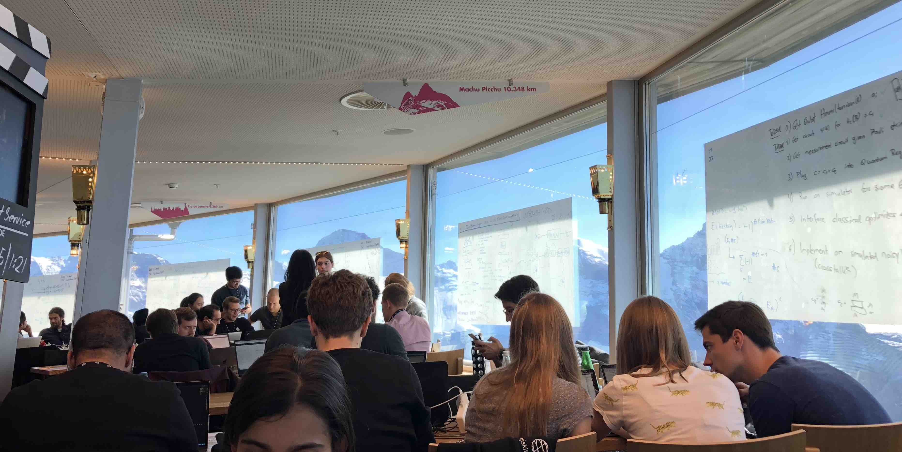
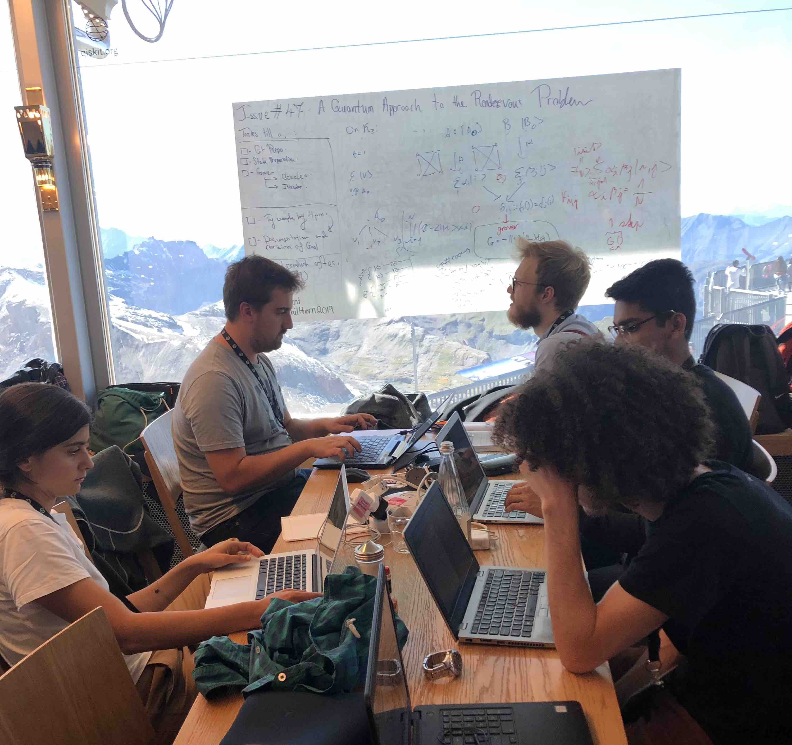
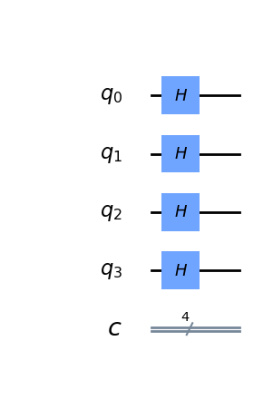

# Quantum Approach to the Rendezvous Problem using Qiskit
This is the repository for Team Rendezvous at the Qiskit Camp 2019 taking place in Mürren, Switzerland. 

## Qiskit Camp 
Qiskit is an open-source quantum computing framework for leveraging today's quantum processors in research, education, and business. 

A few pictures of the hackathon & the beautiful city of Mürren:

Here is a picture of our team hard at work: 

When the algorithm works: 

## The Classical Rendezvous Conundrum 
The aim is to build on a quantum advantage by using Grover's algorithm to the Rendezvous Problem. The problem is as follows: Alice & Bob, two 20-year-olds, have agreed to meet at a park. The only details they have before hand is the date and time of their meeting and a pre-agreed strategy on how they'll find each other. Once Alice and Bob arive at the park, they have no means of communicating with each other. The connundrum they face is based on the method of finding each other, which route would lead to the best possible probability of findind the other? How much time would that take? Should they wait before they start or wait at any point during their search?

The idea and process behind the classical approach is described in detail in this [research paper](https://epubs.siam.org/doi/10.1137/S0363012993249195).

## Our Problem
After seeing that it was going to be very limiting to attack the classical problem with no communication since it would have prevented us from using entangled qubits, we decided to pivot and make the problem cooler. Instead of creating an algorithm which two parties could independently apply in a maze to find each other we created an algorithm which would bring two quantum parties together. Think of it as an algorithm applied by some God with access to a quantum computer to bring the quantum particles together.
Our maze in this case was the complete graph on four vertices, K4 and after spawning Alice and Bob at two different spots on K4 it was the god's job to make sure they end up in the same spot with some definite probability.

## The Implementation
Our two quantum parties, Alice and Bob have qubit registers comprised of 2 qubits each which encode their positions at vertices on K4. Additionally ancillary qubits are used to implement our oracle.
The algorithm starts by preparing an input state. We start with our qubits all in the |0> state, their tensor product being the input state. We then take a superposition over all the possible locations on the graph by applying a Hadamard gate across the initial state. 

 

At this point we have prepared our state and we are ready to start our Grover Search to amplify the case where Alice and Bob are sitting on the same vertex.

We also implemented Grover's algorithm for 4 Quibits and the results are located in the folder "Grover's Algorithm"

Our solution has been implemented and can be seen in the python script - Rendezvous.py. This was the circuit we built.

A special shoutout to the Qiskit team for all the support throughout this event. Another special mention to the [Qiskit textbook](https://community.qiskit.org/textbook/) which has brilliantly described and illustrated how to build a circuit implementin Grover's search algorithm using the Qiskit resources. 

